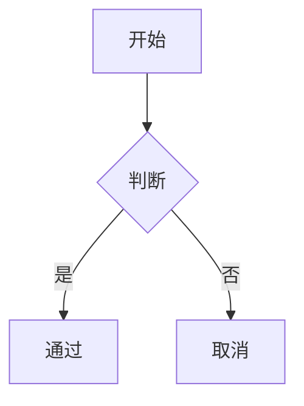

# Markdown Editor — 项目手册

## 快速开始

### 环境要求

- Flutter SDK >= 3.16.0 (开发使用 3.38.6)
- Dart >= 3.2.0
- Android Studio / VS Code (推荐)

### 安装与运行

```bash
# 1. 克隆项目
cd markdown_editor

# 2. 获取依赖
flutter pub get

# 3. 运行 (Web — 最快捷)
flutter run -d chrome --web-port=4321

# 4. 运行 (Linux 桌面)
flutter run -d linux

# 5. 运行 (Android/iOS)
flutter run -d <device_id>
```

### 构建产物

```bash
flutter build web --no-web-resources-cdn  # Web → build/web/
flutter build linux                        # Linux → build/linux/
flutter build apk                          # Android → build/app/outputs/
flutter build ios                          # iOS → build/ios/
```

---

## 功能清单

### P0 — 核心功能 (已完成 ✓)

| 编号 | 功能 | 状态 |
|------|------|------|
| P0-1 | 文本编辑 (re_editor CodeEditor) | ✓ |
| P0-2 | 实时 Markdown 预览 (flutter_markdown) | ✓ |
| P0-3 | 格式化工具栏 | ✓ |
| P0-4 | 文档保存/打开 (Hive 持久化) | ✓ |
| P0-5 | 文档管理 (新建/删除/重命名) | ✓ |
| P0-6 | 双栏/单栏/纯预览切换 | ✓ |
| P0-7 | 深色/浅色/跟随系统主题 | ✓ |

### P1 — 1.0 必备 (已完成 ✓)

| 编号 | 功能 | 状态 |
|------|------|------|
| P1-1 | Markdown 语法高亮 (re_highlight) | ✓ |
| P1-2 | 行号显示 | ✓ |
| P1-3 | 自动保存 (可配置间隔) | ✓ |
| P1-4 | 最近文件列表 | ✓ |
| P1-5 | 导出 HTML / PDF | ✓ |
| P1-6 | 查找/替换 | ✓ |
| P1-7 | 字体大小调节 (Ctrl+滚轮) | ✓ |
| P1-8 | 撤销/重做 | ✓ |
| P1-9 | 移动端适配 (响应式布局) | ✓ |
| P1-10 | 键盘快捷键 | ✓ |

### P2 — 增强功能 (部分完成)

| 编号 | 功能 | 状态 |
|------|------|------|
| P2-3 | 文件夹管理 | ✓ |
| P2-4 | 标签系统 | ✓ |
| P2-6 | 代码块语法高亮预览 | ✓ |
| P2-7 | 数学公式 LaTeX (块级 + 行内) | ✓ |
| P2-8 | Mermaid 流程图 | ✓ |
| P2-9 | 版本历史 | ✓ |
| P2-10 | 多标签页编辑 | ✓ |
| P2-11 | 文档大纲面板 | ✓ |
| P2-12 | 文件管理器 (排序/导入/批量) | ✓ |
| P2-13 | GFM 任务列表 | ✓ |
| P2-14 | 字数统计 & 阅读时间 | ✓ |
| P2-1 | 云端同步 | 待定 |
| P2-5 | 全文搜索增强 | 待定 |

---

## 用户指南

### 编辑器

#### 编辑模式

- **双栏**: 左侧编辑 + 右侧实时预览 (桌面端默认)
- **仅编辑**: 全屏编辑区
- **仅预览**: 全屏预览区

移动端 (< 600px 宽) 自动切换到单栏模式，底部提供编辑/预览切换按钮。

#### 工具栏按钮

```
[撤销] [重做] | [H1] [H2] [H3] | [B] [I] [S] | [🔗] [🖼] [</>] |
[无序列表] [有序列表] [引用] [代码块] | [分割线] [表格]
```

每个按钮在光标处或选中文本上应用对应的 Markdown 语法。

#### 版本历史

- 每次手动保存 (Ctrl+S) 或退出时自动创建版本快照
- 点击 AppBar 时钟图标查看所有版本
- 点击版本预览内容，可恢复到任意历史版本
- 每个文档最多保留 50 个版本

### 文档管理

#### 文件夹

- 首页顶部横向滚动的文件夹卡片
- 点击进入文件夹，仅显示该文件夹内文档
- 长按文件夹: 重命名 / 删除
- 非空文件夹禁止删除
- 新建文档/文件夹自动归属当前目录

#### 标签

- 标签筛选栏: 点击标签 FilterChip 筛选文档
- 长按文档 → "管理标签": 添加/移除/新建标签
- 文档列表项显示标签小方块
- 文件夹 + 标签筛选可组合使用

### 标签页管理

编辑器支持同时打开多个文档，标签栏位于工具栏上方：

- **打开文档**: 从首页点击任意文档，自动在新标签中打开
- **切换标签**: 点击标签、或 Ctrl+Tab / Ctrl+Shift+Tab
- **关闭标签**: 点击标签上的 ×、Ctrl+W、或鼠标中键点击标签
- **右键菜单**: 右键标签 → 关闭 / 关闭其他 / 关闭全部
- **新建标签**: 点击标签栏右侧 + 按钮，创建空白文档
- 切换标签时自动保存当前文档内容
- 关闭全部标签后自动返回首页

### 文档大纲

- 点击 AppBar 大纲按钮 (☰) 切换大纲面板
- 自动解析文档中的 H1-H6 标题，层级缩进显示
- 当前编辑位置对应的标题自动高亮
- 点击标题 → 编辑器自动滚动到对应行
- 桌面端在右侧显示 200px 面板，移动端不显示

### 文件管理器

首页右上角文件夹图标 → 打开文件管理器：

- **排序**: 支持按名称/日期/文件大小排序，可切换升序/降序
- **导入**: 从本地文件系统导入 .md 文件，支持多选
- **批量操作**: 点击「更多操作 → 批量选择」进入选择模式，可批量删除/导出
- **删除全部**: 一键删除所有文件（含确认对话框）
- **单文件操作**: 打开编辑 / 导出为 .md / 删除

### 代码语法高亮 (预览区)

预览区中的代码块自动语法高亮，支持 ~190 种语言：

````markdown
```python
def fibonacci(n):
    if n <= 1:
        return n
    return fibonacci(n-1) + fibonacci(n-2)
```
````

- 根据编辑器主题自动切换深色/浅色高亮配色
- 代码块顶部显示语言名称标签
- 未指定语言的代码块使用等宽纯文本渲染
- 长代码行支持横向滚动

### GFM 任务列表

预览区支持 GFM 风格任务列表：

```markdown
- [ ] 待办事项
- [x] 已完成事项
```

- `- [ ]` 渲染为空心复选框
- `- [x]` 渲染为勾选复选框 (主题色)

### 查找/替换

- **Ctrl+F**: 打开查找栏
- **Ctrl+H**: 打开查找+替换栏
- 支持大小写不敏感搜索
- 匹配计数、上一个/下一个导航
- 替换当前 / 全部替换
- **Esc**: 关闭查找栏

### 导出

- 点击 AppBar 分享图标 → 导出面板
- **复制 HTML**: 将 HTML 源码复制到剪贴板
- **下载文件**: 下载 .html 文件到本地
- **导出 PDF**: 调用系统打印对话框，可另存为 PDF 文件（桌面/Web/移动端均支持）
- HTML 包含完整的暗色模式 CSS

### 数学公式

**块级公式** — 使用 ` ```math ` 围栏代码块:

````markdown
```math
\frac{d}{dx} \int_a^x f(t) dt = f(x)
```
````

**行内公式** — 使用 `$...$` 包裹:

```markdown
质能方程 $E=mc^2$ 由爱因斯坦提出
```

渲染引擎: flutter_math_fork (基于 KaTeX)

### Mermaid 流程图

使用 ` ```mermaid ` 围栏代码块编写图表:

````markdown

````

支持的图表类型: Flowchart、Sequence Diagram、Pie Chart、Gantt Chart、Timeline、Kanban Board、Radar Chart、XY Chart。

渲染引擎: flutter_mermaid (纯 Dart，无 WebView)

### 预览缩放

- 移动端/触控板: 双指捏合缩放预览内容 (0.5x - 3.0x)
- 桌面端: Ctrl+滚轮缩放编辑区字体

---

## 快捷键

| 快捷键 | 功能 |
|--------|------|
| Ctrl+B | 加粗 (**text**) |
| Ctrl+I | 斜体 (*text*) |
| Ctrl+K | 插入链接 (\[text\](url)) |
| Ctrl+S | 保存 |
| Ctrl+F | 查找 |
| Ctrl+H | 替换 |
| Ctrl+Z | 撤销 |
| Ctrl+Y | 重做 |
| Ctrl+Tab | 切换到下一标签 |
| Ctrl+Shift+Tab | 切换到上一标签 |
| Ctrl+W | 关闭当前标签 |
| Ctrl+滚轮 | 缩放字体 (10-24px) |

---

## 设置

| 设置项 | 选项 | 默认值 |
|--------|------|--------|
| 主题 | 浅色 / 深色 / 跟随系统 | 跟随系统 |
| 默认编辑模式 | 双栏 / 仅编辑 / 仅预览 | 双栏 |
| 字体大小 | 10-24 px | 14 px |
| 自动保存 | 关闭 / 5s / 15s / 30s / 60s | 关闭 |

---

## 平台支持

| 平台 | 状态 | 备注 |
|------|------|------|
| Web | ✓ 完整 | PWA 待定 |
| Linux | ✓ 完整 | 需安装 GTK3 开发库 |
| Windows | ✓ 构建通过 | 未深度测试 |
| macOS | ✓ 构建通过 | 未深度测试 |
| Android | ✓ 构建通过 | 响应式布局已适配 |
| iOS | ✓ 构建通过 | 未深度测试 |
| HarmonyOS | 理论支持 | Flutter 鸿蒙分支 |

---

## 已知限制

1. **大文件性能**: >1MB 文件建议使用纯编辑模式，预览区可能卡顿
2. **嵌套文件夹**: 仅支持一层文件夹，不支持文件夹内再创建文件夹
3. **图片**: 不支持图片粘贴和本地图片管理
4. **协作编辑**: 不支持多人同时编辑
5. **标签页持久化**: 标签页在应用重启后不保留

## 未来规划

- P2-5: 全文搜索索引
- P2-6: 图片上传 (图床)
- P2-15: 文件关联 (.md 默认打开)
- P2-16: 标签页会话恢复
- P3: 云端同步、插件系统、嵌套文件夹、协作编辑
